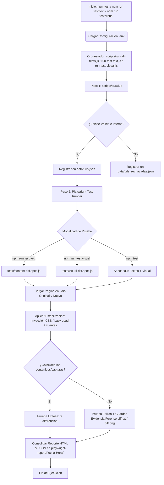

# Content Migration Validator 🚀

[](https://nodejs.org/)
[](https://playwright.dev/)
[](https://github.com/mapbox/pixelmatch)
[](https://developer.mozilla.org/es/docs/Web/JavaScript)
[](https://opensource.org/licenses/ISC)

Una herramienta automatizada y profesional de **QA Automation** diseñada para la **auditoría y validación de migración de contenidos web**. Su propósito fundamental es comparar un **sitio ORIGINAL (de referencia/baseline)** contra un **sitio NUEVO (migrado o rediseñado)** para certificar que no existan discrepancias visuales ni pérdidas de contenido textual antes de su liberación a producción.

El sistema funciona en dos fases consecutivas y automatizadas:

1. **Fase de Rastreo (Crawling):** Analiza el sitio web original de manera iterativa para descubrir todas las páginas internas elegibles, sanitizar sus URLs y generar el catálogo de rutas a probar.
2. **Fase de Validación (Testing):** Ejecuta pruebas automatizadas y concurrentes con Playwright para extraer y contrastar el texto normalizado y el aspecto visual pixel a pixel entre ambos entornos, reportando detalladamente cualquier inconsistencia encontrada.

---

## 📋 Tabla de Contenidos

- [Flujo General del Sistema](#-flujo-general-del-sistema)
- [Mejoras y Capacidades Implementadas](#-mejoras-y-capacidades-implementadas)
  - [1. Validación Textual Inteligente](#1-validación-textual-inteligente)
  - [2. Validación Visual Estabilizada (Pixelmatch)](#2-validación-visual-estabilizada-pixelmatch)
- [Arquitectura del Proyecto](#-arquitectura-del-proyecto)
- [Prerrequisitos e Instalación](#-prerrequisitos-e-instalación)
- [Variables de Entorno](#-variables-de-entorno)
- [Ejecución de Pruebas](#-ejecución-de-pruebas)
- [Estructura de Reportes y Evidencias](#-estructura-de-reportes-y-evidencias)
- [Patrones de Diseño y Buenas Prácticas QA](#-patrones-de-diseño-y-buenas-prácticas-qa)

---

## 🔄 Flujo General del Sistema

El ciclo de ejecución está completamente automatizado por los scripts orquestadores y se resume en el siguiente diagrama:



### Descripción del Flujo:

1. **Inicialización:** Se leen las URLs base configuradas en el archivo `.env` y se genera una carpeta única de reporte basada en fecha y hora.
2. **Fase de Rastreo (`scripts/crawl.js`):** Recorre el sitio original. Las rutas válidas se guardan en `data/urls.json` y las descartadas en `data/urls_rechazadas.json` detallando el motivo del descarte.
3. **Fase de Testing:**
   - **Validación de Texto (`tests/content-diff.spec.js`):** Extrae el texto del selector configurado (por defecto `main`), expande elementos colapsados, normaliza espacios y compara contra el nuevo sitio, generando `diff.txt` si hay desajustes.
   - **Validación Visual (`tests/visual-diff.spec.js`):** Oculta elementos dinámicos, estabiliza el renderizado, fuerza lazy load, captura screenshots de alta resolución y compara a nivel de píxel con `pixelmatch`, generando `diff.png` si detecta diferencias.
4. **Reportería y Evidencias:** Se consolidan reportes interactivos HTML y resúmenes JSON, junto con las evidencias organizadas en subcarpetas `Evidencias-Textos/` y `Evidencias-Capturas/`.

---

## 🌟 Mejoras y Capacidades Implementadas

### 1. Validación Textual Inteligente

- **Expansión Automática de Contenido Oculto/Colapsado:** Mediante la inyección de estilos `EXPAND_HIDDEN_CONTENT_CSS`, se fuerza la apertura de acordeones (`.collapse`, `.collapsing`, `[class*="collapse"]`) y etiquetas `<details:not([open])>`. Esto garantiza que los textos dentro de componentes interactivos se extraigan sin requerir eventos de clic.
- **Generación de Diffs Unificados (`diff.txt`):** Utiliza la biblioteca `diff` (`diffLines`) para reportar exactamente las líneas agregadas (`+`) o faltantes (`-`).
- **Normalización Preventiva contra Falsos Negativos:** Colapsa saltos de línea y secuencias de espacios redundantes mediante `normalizeText` antes de la comparación.
- **Manejo Defensivo de Selectores:** Si una página no cuenta con el selector evaluado (ej. `<main>`), la prueba se omite de forma controlada (`test.skip`) sin provocar falsos fallos en la suite.

### 2. Validación Visual Estabilizada (Pixelmatch)

La suite de regresión visual resuelve los principales desafíos de inconsistencia en renderizado web:

1. **Aislamiento Visual por Inyección de CSS (`HIDE_DYNAMIC_ELEMENTS_CSS`):**
   Oculta deliberadamente elementos que generan fluctuaciones de layout o altura:
   - Políticas y banners de cookies: `.cookie-policy-container`, `.cookie-banner`, `#cookie-banner`.
   - Cabeceras y navegación: `header`, `.headHome`, `.header-talet`.
   - Pie de página: `footer`.
   - Menús flotantes e interiores: `#MenuInterior`.
   - Widgets de soporte y chat en vivo: `.crm`, `.ChatXS_Icon`.
2. **Estabilización de Renderizado (`waitForPageStability`):**
   Espera a que todas las fuentes web (`document.fonts.ready`) y las imágenes del documento (`img.complete`) estén totalmente cargadas.
3. **Carga Forzada de Lazy Load (`forceLazyLoadRendering`):**
   Realiza un scroll programado hasta el final de la página y regresa a la parte superior para activar elementos con carga diferida antes de la captura.
4. **Recálculo de Layout (`forceLayoutRecalculation`):**
   Dispara un evento `resize` para forzar a sliders, carruseles y componentes responsivos a calcular su posición final.
5. **Detección de Elementos Atorados y Recarga Inteligente (_Smart Reload_):**
   Si elementos críticos (como fichas técnicas: `.dato-ficha`, `.btn-ficha`) tienen altura o ancho en 0 por ejecución asíncrona de JavaScript, espera activamente hasta 4s. Si continúan atorados, ejecuta un `page.reload({ waitUntil: 'domcontentloaded' })` (evitando `networkidle` para prevenir bloqueos por analítica de terceros).
6. **Protección de Buffers y Concurrencia:**
   Desactiva animaciones CSS (`animations: 'disabled'`), introduce micro-pausas y valida que el buffer de imagen tenga una longitud adecuada (`length > 100`) para evitar buffers corruptos en ejecuciones paralelas.
7. **Control Estricto de Dimensiones:**
   Verifica el tamaño exacto (ancho x alto) antes de invocar `pixelmatch`. Si difieren, lanza un error descriptivo con las dimensiones para auditar el motivo del salto visual.
8. **Trazabilidad Forense en Reintentos (`testInfo.retry`):**
   Si un test falla y se reintenta según la política configurada (`retries: 1`), las evidencias se guardan con el sufijo `-Retry-1.png`, preservando la evidencia del intento inicial.

---

## 📂 Arquitectura del Proyecto

Estructura actual del directorio y propósito de cada componente:

```text
content-migration-validator/
├── data/                            # Datos dinámicos generados por el crawler
│   ├── urls.json                    # Catálogo de URLs elegibles para testing
│   └── urls_rechazadas.json         # Registro de URLs descartadas con su motivo
├── scripts/                         # Scripts ejecutables y orquestadores
│   ├── crawl.js                     # Crawler web basado en Playwright para descubrimiento de rutas
│   ├── run-all-tests.js             # Orquestador principal (Crawler + Textos + Visual)
│   ├── run-test-text.js             # Orquestador específico para pruebas de contenido textual
│   └── run-test-visual.js           # Orquestador específico para pruebas de regresión visual
├── tests/                           # Suites de pruebas automatizadas
│   ├── content-diff.spec.js         # Validación de igualdad de texto y generación de diff.txt
│   └── visual-diff.spec.js          # Validación visual pixel a pixel con pixelmatch y diff.png
├── utils/                           # Módulos de soporte y funciones auxiliares
│   ├── dateTime.js                  # Generador de marcas de tiempo únicas para directorios de reporte
│   ├── textNormalizaer.js           # Limpieza y normalización de texto plano
│   └── urlsNormalizaer.js           # Sanitizador de URLs (remoción de fragmentos, parámetros y trailing slash)
├── .env.example                     # Plantilla de configuración de variables de entorno
├── .gitignore                       # Exclusiones de Git (node_modules, reportes, archivos .env locales)
├── package.json                     # Scripts de ejecución NPM y dependencias
├── playwright.config.js             # Configuración central de Playwright (concurrencia, timeout, reporters)
└── README.md                        # Documentación técnica completa del proyecto
```

---

## 🛠️ Prerrequisitos e Instalación

### Requisitos del Sistema

- **Node.js:** Versión `v18.x` o superior (se recomienda LTS).
- **NPM:** Gestor de paquetes integrado de Node (v9.x o superior).

### Instrucciones de Configuración

1. **Clonar el proyecto** en tu entorno local:

   ```bash
   git clone https://github.com/tgomez-jpg/content-migration-validator.git
   cd content-migration-validator
   ```

2. **Instalar las dependencias de Node.js**:

   ```bash
   npm install
   ```

3. **Instalar el navegador de Playwright** (Chromium es el navegador configurado):
   ```bash
   npx playwright install chromium
   ```

---

## ⚙️ Variables de Entorno

El proyecto lee la configuración de un archivo `.env` en la raíz. Para configurarlo, crea una copia de `.env.example`:

```bash
cp .env.example .env
```

Abre el archivo `.env` y define los dominios que deseas auditar:

```env
# URL del sitio actual/antiguo de referencia (Original)
BASE_URL_ORIGINAL=https://sitio-original.com

# URL del nuevo sitio migrado a validar (Nuevo)
BASE_URL_NUEVO=https://sitio-nuevo.com
```

> [!TIP]
> **Estrategia Baseline:** Para validar la estabilidad de la herramienta, se recomienda apuntar `BASE_URL_ORIGINAL` y `BASE_URL_NUEVO` a la misma URL de control. El resultado esperado debe ser **0 diferencias** visuales y textuales. Una vez comprobada la estabilidad, modifica `BASE_URL_NUEVO` hacia el sitio migrado real.

> [!IMPORTANT]
> Asegúrate de no incluir una barra diagonal (`/`) al final de los dominios en las variables de entorno para evitar errores en la concatenación de las rutas.

---

## 🧪 Ejecución de Pruebas

El proyecto cuenta con scripts centralizados en el [`package.json`](file:///c:/.../content-migration-validator/package.json):

| Comando               | Descripción                                                                                                                                                                     |
| :-------------------- | :------------------------------------------------------------------------------------------------------------------------------------------------------------------------------ |
| `npm test`            | **Suite Completa:** Ejecuta el crawler y corre en secuencia las pruebas de texto (`content-diff.spec.js`) y visuales (`visual-diff.spec.js`), generando un resumen consolidado. |
| `npm run test:text`   | **Solo Textos:** Ejecuta el crawler y corre exclusivamente la validación de texto plano.                                                                                        |
| `npm run test:visual` | **Solo Visual:** Ejecuta el crawler y corre exclusivamente la validación visual pixel a pixel.                                                                                  |

### Ejecución y Depuración Individual

Si necesitas aislar o depurar un paso en específico del flujo sin usar los scripts orquestadores:

- **Ejecutar solo el rastreador (Crawler):**
  Genera o actualiza la lista de páginas a auditar en `data/urls.json` y `data/urls_rechazadas.json`:

  ```bash
  node scripts/crawl.js
  ```

- **Ejecutar solo la comparación de textos (sin re-rastrear):**
  _(Requiere haber generado previamente `data/urls.json`)_:

  ```bash
  npx playwright test tests/content-diff.spec.js
  ```

- **Ejecutar solo la comparación visual (sin re-rastrear):**
  _(Requiere haber generado previamente `data/urls.json`)_:

  ```bash
  npx playwright test tests/visual-diff.spec.js
  ```

- **Ejecutar pruebas en Modo Interactivo (Playwright UI Mode):**
  Excelente para ver el flujo de navegación visualmente y depurar fallas paso a paso con trazabilidad interactiva:
  ```bash
  npx playwright test --ui
  ```

---

## 📊 Estructura de Reportes y Evidencias

Los scripts orquestadores crean dinámicamente un directorio basado en la fecha y hora de ejecución bajo la ruta `playwright-report/Fecha-YYYY-MM-DD_Hora-HH-MM-SS/`:

```text
playwright-report/Fecha-2026-09-14_Hora-09-30-15/
├── html/
│   └── index.html                # Reporte HTML interactivo con estadísticas y logs de pasos
├── results.json                  # Resultados estructurados en formato JSON (ideal para CI/CD)
├── Evidencias-Textos/            # Evidencias de comparación de contenido textual
│   └── <nombre-ruta>/
│       ├── original.txt          # Texto plano obtenido del sitio original
│       ├── nuevo.txt             # Texto plano obtenido del sitio nuevo
│       └── diff.txt              # (Solo si hay fallo) Diferencias línea por línea (+/-)
└── Evidencias-Capturas/          # Evidencias de comparación visual
    └── <nombre-ruta>/
        ├── original.png          # Captura del selector en el sitio original
        ├── nuevo.png             # Captura del selector en el sitio nuevo
        ├── diff.png              # (Solo si hay fallo) Imagen comparativa resaltando píxeles dispares
        ├── original-Retry-1.png  # Evidencias preservadas en caso de reintentos
        └── nuevo-Retry-1.png
```

### Comando para Visualizar el Reporte HTML

Para abrir el servidor local de Playwright y visualizar el reporte HTML generado en una ejecución específica:

```bash
npx playwright show-report playwright-report/Fecha-YYYY-MM-DD_Hora-HH-MM-SS/html
```

_(Sustituye `Fecha-YYYY-MM-DD_Hora-HH-MM-SS` por la carpeta generada e impresa en consola al inicio de la ejecución)._

---

## 🎨 Patrones de Diseño y Buenas Prácticas QA

- **Data-Driven Testing (DDT):** Los casos de prueba no están cableados estáticamente. Las suites leen e iteran dinámicamente sobre la colección registrada en `data/urls.json`, lo que permite validar tanto sitios pequeños como portales con cientos de páginas sin alterar el código de prueba.
- **Separación de Responsabilidades (SoC):**
  - El crawling y descubrimiento de enlaces reside en `scripts/crawl.js` con sanitización en `utils/urlsNormalizaer.js`.
  - La normalización de texto y manejo temporal se abstraen en `utils/textNormalizaer.js` y `utils/dateTime.js`.
  - Las suites de testing (`tests/`) permanecen desacopladas entre sí.
  - La configuración general de entorno, timeouts y concurrencia se administra centralizadamente en `playwright.config.js`.
- **Ejecución Concurrente y Optimizada:** Configurado con `fullyParallel: true`, un límite controlado de `workers: 4` y un viewport estándar de `1920x1080` en Chromium, optimizando los tiempos de ejecución y manteniendo la estabilidad de memoria del sistema.
- **Trazabilidad y Análisis Forense:** En caso de fallas, la generación simultánea de archivos de origen (`original`), destino (`nuevo`) y comparación (`diff`) reduce drásticamente el tiempo de análisis de causa raíz para el equipo de QA y desarrollo.
