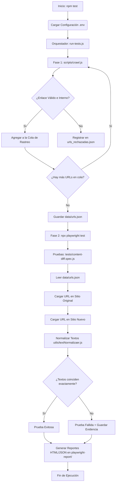

# Content Migration Validator 🚀

[](https://nodejs.org/)
[](https://playwright.dev/)
[](https://developer.mozilla.org/es/docs/Web/JavaScript)
[](https://opensource.org/licenses/ISC)

Una herramienta automatizada y profesional para la **validación y auditoría de migración de contenidos web**. Su propósito principal es asegurar que durante un proceso de migración de plataforma o rediseño no ocurra pérdida de información ni discrepancias en el texto expuesto al usuario.

El sistema funciona en dos fases consecutivas y automatizadas:
1. **Fase de Rastreo (Crawling):** Analiza el sitio web original de manera iterativa para mapear todas las páginas internas y generar un catálogo de URLs elegibles.
2. **Fase de Validación (Testing):** Ejecuta pruebas de comparación automática con Playwright para extraer y contrastar el texto normalizado del sitio antiguo contra el sitio nuevo, reportando detalladamente cualquier inconsistencia.

---

## 🔄 Flujo General del Proyecto

El ciclo de vida de la ejecución está automatizado por el script orquestador y se resume en el siguiente flujo secuencial:



### Descripción del Flujo:
1. **Inicialización:** Se leen las URLs base configuradas en el archivo `.env`.
2. **Fase de Crawling (`crawl.js`):** Se rastrea el sitio original de manera iterativa. Las rutas válidas se guardan en `data/urls.json` y las ignoradas/rechazadas en `data/urls_rechazadas.json` detallando el motivo.
3. **Fase de Testing (`content-diff.spec.js`):** Playwright lee las URLs registradas y lanza las pruebas en paralelo. Abre simultáneamente el sitio original y nuevo, limpia caracteres invisibles o espaciados redundantes y compara la igualdad del texto en el elemento `main`.
4. **Reportería:** Se consolidan los resultados en un reporte HTML dinámico estructurado por fecha/hora y archivos JSON con logs detallados.

---

## 📂 Arquitectura del Proyecto

A continuación se detalla la estructura del directorio raíz y la responsabilidad de cada componente clave:

```text
content-migration-validator/
├── data/                            # Datos generados dinámicamente
│   ├── urls.json                    # URLs exitosamente rastreadas y listas para validación
│   └── urls_rechazadas.json         # URLs omitidas en el crawling con su respectivo motivo
├── scripts/                         # Scripts de ejecución y automatización
│   ├── crawl.js                     # Crawler dinámico basado en Playwright para descubrimiento de rutas
│   └── run-tests.js                 # Orquestador del flujo completo (crawling + testing)
├── tests/                           # Suite de pruebas automatizadas
│   ├── content-diff.spec.js         # Pruebas de comparación de texto plano entre entornos
│   └── visual-diff.spec.js          # Estructura preparada para validaciones visuales por pixel
├── utils/                           # Módulos de soporte y utilerías comunes
│   ├── dateTime.js                  # Formateador de fecha/hora para reportes con marcas de tiempo únicas
│   ├── textNormalizaer.js           # Limpieza y normalización de espacios y saltos de línea en textos
│   └── urlsNormalizaer.js           # Sanitizador de URLs (remoción de hashes, query params y trailing slashes)
├── .env.example                     # Plantilla de configuración para variables de entorno
├── .gitignore                       # Exclusiones de Git (node_modules, reportes, archivos .env locales)
├── package.json                     # Definición del proyecto, dependencias y scripts NPM
├── playwright.config.js             # Configuración centralizada de Playwright Test
└── README.md                        # Guía de uso y documentación del proyecto
```

### Detalle de Componentes Clave:
* **`scripts/crawl.js`**: Utiliza un navegador Chromium headless para extraer los enlaces `a[href]` de la página de inicio original. Aplica filtros restrictivos para no salir del dominio base, ignorar extensiones de archivos estáticos (PDF, ZIP, imágenes) y omitir rutas configuradas como excluidas (ej: `/twitter`).
* **`tests/content-diff.spec.js`**: Lee recursivamente `data/urls.json` y, para cada ruta encontrada, abre de forma paralela la página correspondiente en el servidor original y en el servidor nuevo. Extrae el texto interno del selector configurado (por defecto `main` para evitar diferencias de cabeceras/pies de página) y realiza una aserción estricta de igualdad.
* **`tests/visual-diff.spec.js`**: *(⚠️ Proceso no terminado / En desarrollo)* Estructura reservada para futuras comparaciones de diseño visual a nivel de píxel (*pixel-match screenshot regression*). Actualmente se encuentra vacío y listo para ser implementado usando las librerías `pixelmatch` y `pngjs` provistas en las dependencias.
* **`utils/textNormalizaer.js`**: Evita falsos negativos en las pruebas al colapsar múltiples espacios continuos, tabulaciones y saltos de línea en un solo espacio antes de realizar la comparación.
* **`utils/urlsNormalizaer.js`**: Sanitiza y normaliza las URLs descubiertas durante el crawling para evitar registros duplicados. Remueve anclas hash (`#`), elimina parámetros de tracking/sesión específicos (como `COT` y `PM`), y estandariza la presencia del *trailing slash* (`/`) al final de las rutas.

---

## 🛠️ Prerrequisitos e Instalación

### Requisitos del Entorno
* **Node.js**: Versión `v18.x` o superior (se recomienda LTS).
* **NPM**: Gestor de paquetes integrado de Node (v9.x o superior).

### Instrucciones de Configuración

1. **Clonar el proyecto** en tu entorno local:
   ```bash
   git clone <url-del-repositorio>
   cd content-migration-validator
   ```

2. **Instalar las dependencias de Node.js**:
   ```bash
   npm install
   ```

3. **Instalar los navegadores de Playwright** ( Chromium es el navegador configurado por defecto):
   ```bash
   npx playwright install chromium
   ```

---

## ⚙️ Variables de Entorno

El proyecto lee la configuración de un archivo `.env` ubicado en la raíz. Para configurarlo, realiza una copia del archivo de ejemplo y ajusta sus valores:

```bash
cp .env.example .env
```

Abre el archivo `.env` y define los dominios que deseas auditar:

```env
# URL del sitio actual/antiguo de referencia
BASE_URL_ORIGINAL=https://sitio-original.com

# URL del nuevo sitio migrado a validar
BASE_URL_NUEVO=https://sitio-nuevo.com
```

> [!IMPORTANT]  
> Asegúrate de no incluir una barra diagonal al final (`/`) de los dominios para evitar problemas en la concatenación de las rutas.

---

## 🧪 Ejecución de Pruebas

### 1. Ejecución Completa (Crawler + Pruebas de Contenido)
Es el comando recomendado para ejecutar la suite completa. El orquestador rastreará las URLs del sitio original y validará los textos inmediatamente:
```bash
npm test
```
*(También puedes usar `npm run All-tests` que ejecuta el mismo pipeline).*

### 2. Ejecutar de Forma Individual
Si necesitas aislar o depurar un paso en específico del flujo:

* **Ejecutar solo el rastreador (Crawler):**
  Generará o actualizará los archivos en `data/urls.json` y `data/urls_rechazadas.json`:
  ```bash
  node scripts/crawl.js
  ```

* **Ejecutar solo la comparación de Playwright:**
  *(Requiere haber generado previamente el archivo `data/urls.json`)*:
  ```bash
  npx playwright test
  ```

* **Ejecutar pruebas en Modo Interactivo (UI Mode de Playwright):**
  Excelente para ver el flujo de navegación visualmente y depurar fallas paso a paso:
  ```bash
  npx playwright test --ui
  ```

---

## 📊 Reportes de Prueba

El orquestador `run-tests.js` define dinámicamente un directorio para guardar los reportes basado en la fecha y hora de ejecución, bajo la ruta `playwright-report/Fecha-YYYY-MM-DD_Hora-HH-MM-SS/`.

### Estructura de Reportes Generados
Al finalizar cada suite de pruebas, se crean los siguientes archivos en la carpeta correspondiente:
* **Reporte HTML Interactivo:** Ubicado en `playwright-report/<carpeta_ejecución>/html/index.html`. Contiene el desglose de cada prueba ejecutada, logs de pasos y detalles de aserciones.
* **Resultados en Formato JSON:** Ubicado en `playwright-report/<carpeta_ejecución>/results.json`. Ideal para integraciones con CI/CD u otros procesadores de datos.
* **Capturas y Trazas de Fallos:** En caso de fallas, se guardarán capturas de pantalla (`screenshots`) y videos dentro del subdirectorio `test-results/`.

### Comando para Visualizar el Reporte HTML
Para abrir el servidor local de Playwright y visualizar de forma interactiva el reporte HTML generado en una ejecución específica:
```bash
npx playwright show-report playwright-report/Fecha-XXXX-XX-XX_Hora-XX-XX-XX/html
```
*(Sustituye `Fecha-XXXX-XX-XX_Hora-XX-XX-XX` por la carpeta temporal generada e impresa en consola al inicio de la ejecución).*

---

## 🎨 Patrón de Diseño y Buenas Prácticas

Este validador ha sido diseñado bajo estándares estrictos de calidad en automatización QA:

* **Data-Driven Testing (DDT):** Los casos de prueba no están programados de forma estática en el código. El archivo de prueba `content-diff.spec.js` itera dinámicamente sobre la colección de rutas generadas en `data/urls.json`. Esto permite que el mismo código sirva para validar sitios de 5 páginas o de 500 páginas sin modificaciones adicionales.
* **Separación de Responsabilidades (SoC):**
  * La lógica de normalización de textos y URLs se desacopla en la carpeta `utils/`.
  * La configuración del navegador, concurrencia y reportería se delega completamente a `playwright.config.js`.
  * Las credenciales e URLs del sitio web se extraen a través de variables de entorno administradas por `dotenv`.
* **Pruebas en Paralelo:** Aprovechando las bondades de Playwright, la configuración tiene habilitado `fullyParallel: true` y un límite controlado de `workers: 4`, lo que reduce considerablemente el tiempo total de ejecución de la suite al consultar múltiples URLs de manera simultánea.
* **Normalización Preventiva contra Falsos Negativos:** El formateador de textos evita fallas por diferencias menores en estilos CSS (como un simple salto de línea o un espacio extra que no altera visualmente el contenido pero sí la aserción de texto plano).
